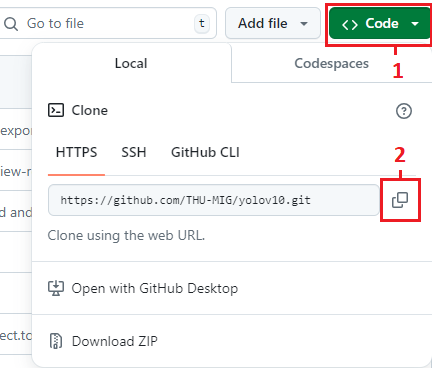

# M01_PROJECT_YOLOv10_OBJECT_DETECTION
<span style="font-size:25px;">Object detection</span>  

**Step 1:** Copy link source from github to **colab**
[Link here](https://github.com/THU-MIG/yolov10)  
<br>  
**Step 2:** Download source code by using this command in **colab**  
```python
!git clone https://github.com/THU-MIG/yolov10.git
```  
</span>

**Step 3:** Install necessary library in file *requirements.txt*  
```python
%cd yolov10
!pip install -q -r requirements.txt
!pip install -e .
```  
**Step 4:** Download weight (w) to your computer and then upload to directory *'content/yolov10'* in **colab**  
[Download here](https://github.com/THU-MIG/yolov10/releases/download/v1.1/yolov10n.pt)  
or you can do download to your **colab** by using the following command  
```python
!wget https://github.com/THU-MIG/yolov10/releases/download/v1.1/yolov10n.pt
```  
To check download successfully or not?  
<br>  

**Step 5:** Download Helmet Safety Detection dataset  
Using the codes below to download file and unzip them to a new directory
```python
!gdown 1twdtZEfcw4ghSZIiPDypJurZnNXzMO7R #dowload file
!mkdir safety_helmet_dataset # create a new directory
!unzip /content/yolov10/Safety_Helmet_Dataset.zip -d safety_helmet_dataset
#move content of unzip file to the new directory
```

**Step 6:** Initialize model
```python
from ultralytics import YOLOv10
MODEL_PATH = 'yolov10n.pt'
model = YOLOv10(MODEL_PATH)
```

**Step 7:** Train model  
Using the codes below
```python
YALM_PATH = '/content/yolov10/safety_helmet_dataset/data.yaml'
EPORCH  = 50
IMG_SIZE = 640
BATCH_SIZE = 64
model.train(
    data=YALM_PATH,
    epochs=EPORCH,
    imgsz=IMG_SIZE,
    batch=BATCH_SIZE)
```
<br> 
<br>   

**Step 7:** Evaluate the trained model  
Using the codes below
```python
from ultralytics import YOLOv10
TRAINED_MODEL_PATH = '/content/yolov10/runs/detect/train/weights/best.pt'
YAML_PATH = '/content/yolov10/safety_helmet_dataset/data.yaml'
IMG_SIZE = 400
model = YOLOv10(TRAINED_MODEL_PATH)

model.val(data=YAML_PATH,
          imgsz=IMG_SIZE,
          split='test')
```  
**Step 8:** Predict image from model  
Using the codes below
```python
from google.colab.patches import cv2_imshow

IMAGE_URL = 'https://d3uwoey2rd901c.cloudfront.net/wp-content/uploads/2018/06/Rice-Media-construction-worker-helmets-colours-occupation.jpg'
CONF_THRESHOLD = 0.3
results = model.predict(source=IMAGE_URL,
                       imgsz=IMG_SIZE,
                       conf=CONF_THRESHOLD)
annotated_img = results[0].plot()

cv2_imshow(annotated_img)
```
<br>


